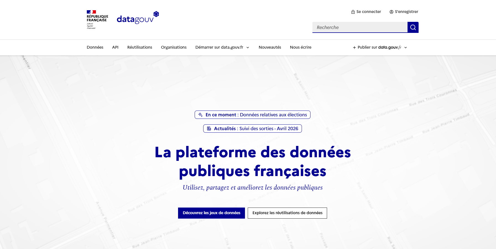

# datagouv-enhanced

Serveur MCP qui enrichit la recherche data.gouv.fr avec un classement de datasets et d'APIs selon un cas d'usage, une zone géographique et des signaux de popularité.



Le serveur s'appuie sur l'endpoint MCP public `https://mcp.data.gouv.fr/mcp`. Il ne remplace pas data.gouv.fr : il collecte les résultats, ajoute des métriques aux datasets et produit un classement local.

## Prérequis

- Python 3.10 ou plus récent
- [uv](https://docs.astral.sh/uv/getting-started/installation/)
- Un client MCP compatible stdio, par exemple Cursor
- Accès réseau à l'endpoint data.gouv.fr pour les outils de collecte

## Installation

Depuis le dossier du projet :

```powershell
cd mcp-datagouv-enhanced
uv sync
Copy-Item .env.example .env
```

Modifie ensuite `.env` :

```dotenv
SEARCH_TERMS=immobilier
USE_CASE=app qui montre les prix immobiliers en gironde
MCP_URL=https://mcp.data.gouv.fr/mcp
```

Le fichier `.env` est local et ne doit jamais être publié. Le fichier `.env.example` est le modèle à partager.

## Lancer le serveur

Le serveur utilise le transport stdio :

```powershell
uv run server.py
```

Pour Cursor, le fichier `.cursor/mcp.json` est déjà configuré pour lancer `uv run server.py` dans le bon dossier. Ouvre la racine du dépôt dans Cursor, puis utilise un agent MCP.

## Utilisation

Demande directement à ton agent :

> Cherche les datasets pertinents pour le prix de l'immobilier en Gironde.

Les outils exposés sont :

- `datagouv_setup` : vérifie la connexion et quelques outils distants ;
- `datagouv_fetch` : collecte datasets et APIs ;
- `datagouv_fetch_datasets` : collecte uniquement les datasets ;
- `datagouv_fetch_api` : collecte uniquement les APIs ;
- `datagouv_analyze(user_request="priorité à la Gironde")` : calcule les scores et les rapports.

La configuration persistante vient de `.env`. La contrainte ponctuelle, comme une zone ou une priorité, vient uniquement de `user_request`.

## Résultats générés

Les appels de collecte et d'analyse écrivent des artefacts locaux sous `mcp-datagouv-enhanced/` :

- `dataset/result_*.txt` et `api/result_*.txt` ;
- `dataset/relevance_scores.json` et `api/relevance_scores.json` ;
- `dataset/ranking_report.md`, `api/ranking_report.md` ;
- `ranking_report.md` et `ranking_report.json`.

Ces fichiers sont ignorés par Git, car ils dépendent de l'état courant de l'API et peuvent devenir obsolètes. Ils sont régénérables avec les outils MCP.

## Comment fonctionne le classement ?

Le score combine 45 % de pertinence textuelle et 55 % de popularité. La pertinence utilise `SEARCH_TERMS`, `USE_CASE` et, si présent, `user_request`. La hiérarchie géographique par défaut favorise la France entière, puis la région, puis le local.

Les métriques de popularité sont réelles pour les datasets lorsque data.gouv.fr les fournit. Les APIs n'ayant pas toujours de métriques directes, le projet peut utiliser un proxy basé sur un dataset proche. Ce proxy est une heuristique et doit être présenté comme tel.

## Développement

```powershell
uv sync
uv run pytest -q
uv run ruff check .
uv run python -m compileall server.py script tests
```

Les tests sont locaux et ne sollicitent pas data.gouv.fr. Les appels réseau sont réservés à l'utilisation réelle du serveur.

## Démonstration vidéo

Une démonstration courte peut montrer : une demande naturelle, la collecte MCP, l'enrichissement par métriques, puis le top 10 expliqué. Indique clairement que le score est un classement heuristique et que les résultats dépendent des données disponibles au moment de l'exécution.

## Attribution et licence

Ce projet utilise l'API et le MCP de [data.gouv.fr](https://www.data.gouv.fr/). Vérifie les conditions et licences propres aux données retournées avant toute redistribution.

Le code est distribué sous licence MIT. Voir [LICENSE](LICENSE).


